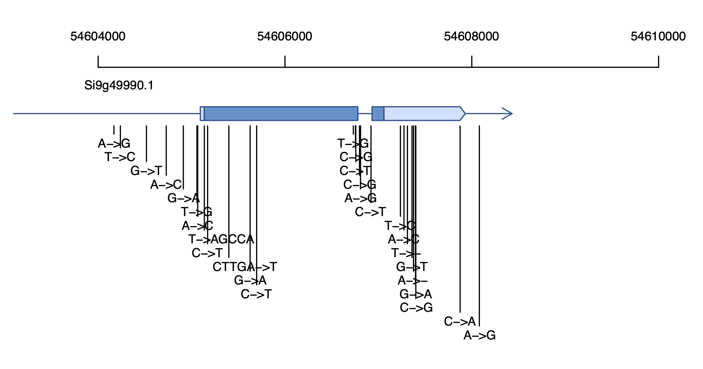
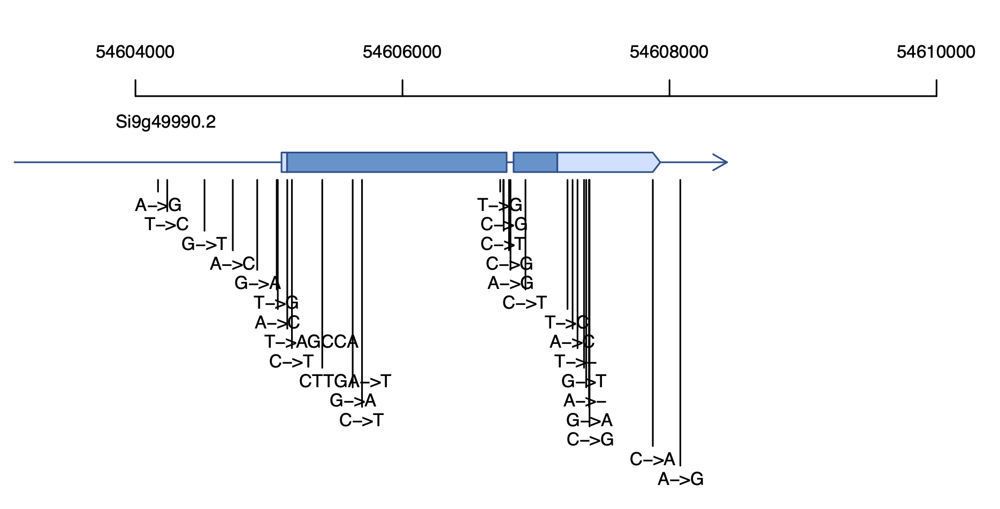

# SNP_Gene_Phenotype2haplotypes.pl
the vcf file of SNPs to haplotypes


## Description
__`SNP_Gene_Phenotype2haplotypes.pl`__ can be used to draw the Gene structure and haplotypes quickly in `PDF` format based on the VCF, GFF and gene's ID. It will become a useful tool for `drawing gene structure` with the advantages of a simple input data format, easily modified output and very good portability. __`SNP_Gene_Phenotype2haplotypes.pl`__ is open source, so all we ask is that you cite our most recent paper in any publications that use this script:</br>
> 基因结构作图.</br>
> A tool to draw Gene structure and haplotypes based on perl and R language.</br>

## Dependencies
__`perl 5`__ and all __`R`__ versions. </br></br>

## Getting started
Put __`Genes_on_Chr.R`__ and GFF files in a same dir, then run:</br>
```
     perl  SNP_Gene_Phenotype2haplotypes.pl  ./Your.hmp  ./Phenotype.txt  ./genome.gff  Your_gene_ID
e.g. perl  SNP_Gene_Phenotype2haplotypes.pl  ./haplotypes.hmp   ./Phenotype.txt  ./test.gff  Si9g49990
```
</br>

## Contact information
For any questions please contact xukai_li@qq.com</br>
